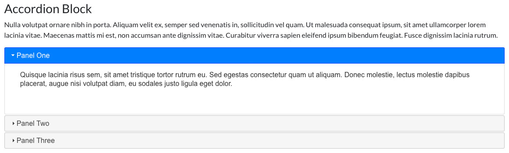
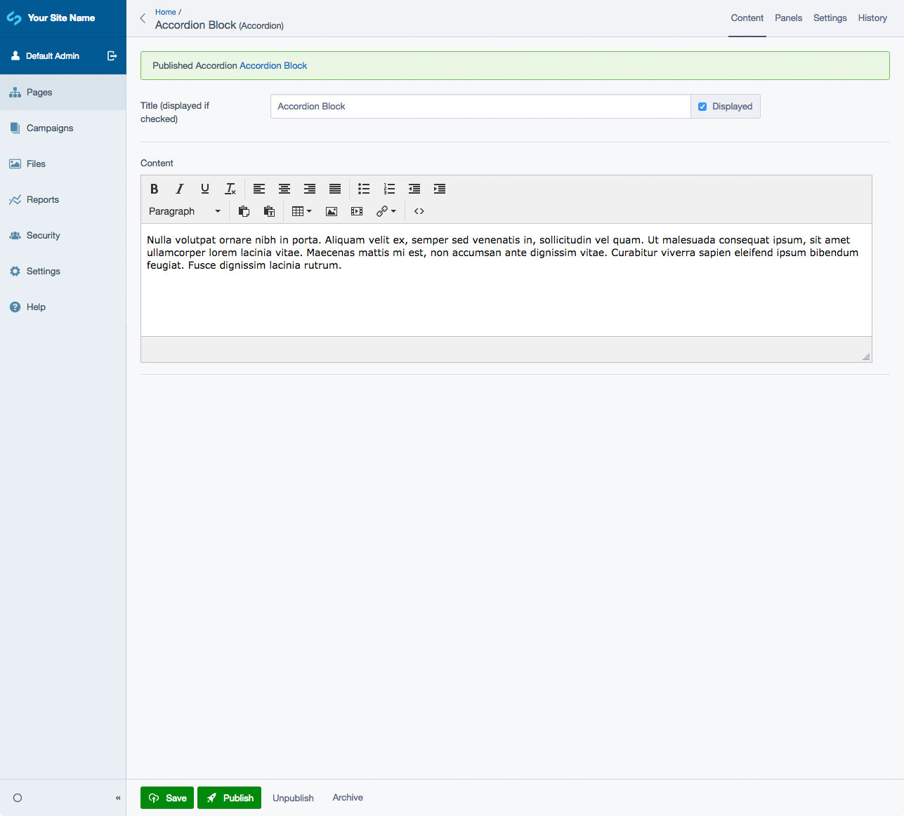
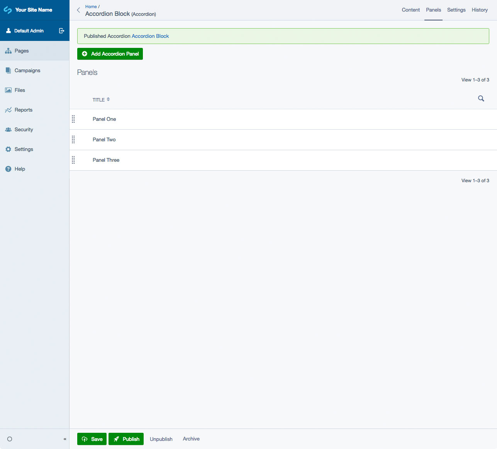
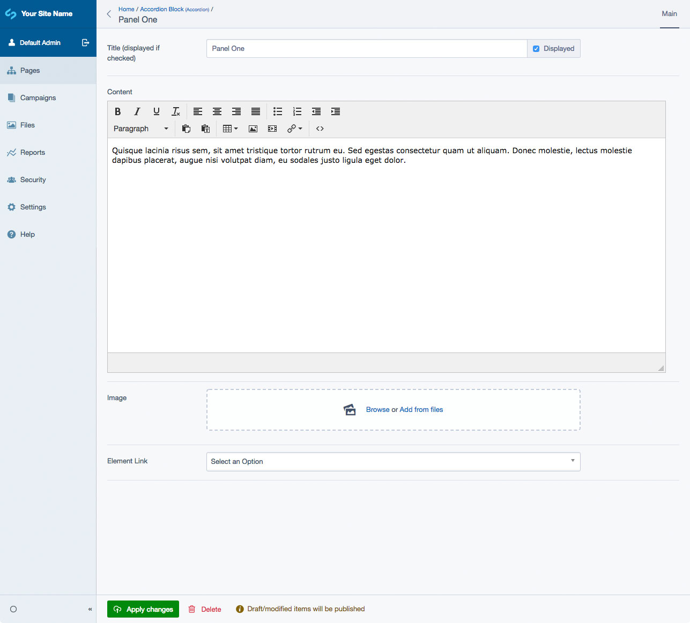

# SilverStripe Elemental Accordion Block

A block that displays content in collapsable panels.

## Requirements

* SilverStripe ^4.0
* SilverStripe Elemental ^2.0

## Installation

`composer require dynamic/silverstripe-elemental-accordion`

## Usage

A block that allows you to create collaspible content blocks. 

## Screen Shots

#### Front End sample of an Accordion

#### CMS - Accordion Main Tab

#### CMS - Accordion Panel List

#### CMS - Accordion Panel Edit

## Getting more elements

See [Elemental modules by Dynamic](https://github.com/dynamic/silverstripe-elemental-blocks#included-blocks)

## Configuration

See [SilverStripe Elemental Configuration](https://github.com/dnadesign/silverstripe-elemental#configuration)